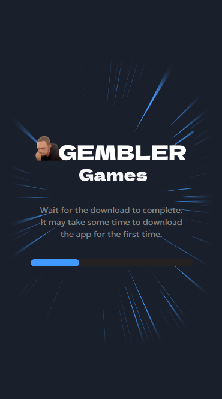
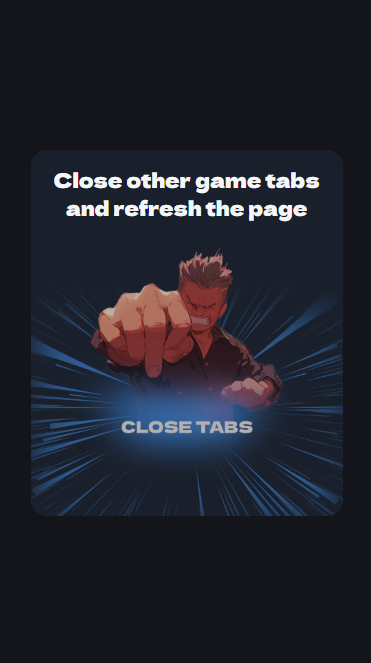
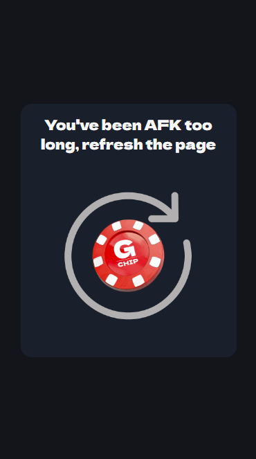
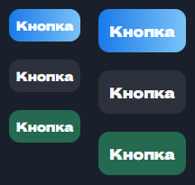
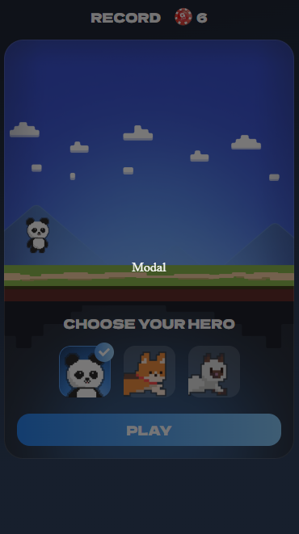
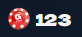
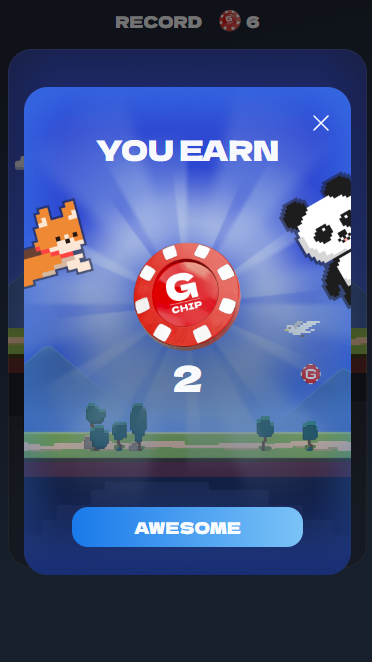
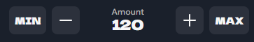

# gg-framework

---

Бибилиотека для создания gembler игр на react. Содержит компоненты и утилиты.

Внутри использует переменные `process.env`

Компоненты:

-  [Game](#game)
-  [GameLoader](#gameloader)
-  [GameMain](#gamemain)
-  [GameError](#gameerror)

Утилиты:


## Установка

---

Чтобы установить пакет в папке с проектом:

```
npm i gg-framework react react-dom
```

## Компоненты

---

### Game

Главная компонента. Содержит важную логику, без которой не будет работать, например, переводы.

```ts
type GameProps = React.PropsWithChildren<{
    className?: string;
    transparent?: string;
}>
```

Связанные компоненты:

-  `<GameLoader />` - отображает загрузку
-  `<GameMain />` - отображает основной экран в игре
-  `<GameError />` - отображает ошибки в игре

Базовый пример использования:

```tsx
<Game>
    <GameLoader
        active={false}
        progress={1}
    />
    <GameMain active={true}>
        test
    </GameMain>
    <GameError active={false} />
</Game>
```

### GameLoader

Компонента для отображения загрузки



```ts
type GameLoaderProps = {
    className?: string;
    active?: boolean;
    progress?: number;
}
```

### GameMain

Компонента для отображения основного экрана в игре. 

```ts
type GameMainProps = React.PropsWithChildren<{
    className?: string;
    active?: boolean;
}>
```

### GameError

Компонента для отображения ошибок в игре

 

```ts
type GameErrorProps = {
    className?: string;
    active?: boolean;
    error?: {
        type: "session";
    } | {
        type: "custom";
        text: string;
    };
};
```

### Button



```ts
export type ButtonProps = React.PropsWithChildren<{
    className?: string;
    onClick?: () => void;
    disabled?: boolean;
    fullWidth?: boolean;
}>
```

### Modal

Компонента для отображения модального окна без самого окна. С анимацией открытия и закрытия.



```ts
type ModalProps = React.PropsWithChildren<{
  className?: string;
  open?: boolean;
}>;
```

### Chips

Отображение количетсво gchip-ов



```ts
type ChipsProps = {
    className?: string;
    value?: number;
    size?: "medium" | "big";
};
```
### Result

Результат выигрыша в игре



```ts
type ResultProps = {
    className?: string;
    open: boolean;
    onClose?: () => void;
    title?: string;
    count?: number;
    coefficient?: string;
    highScore?: boolean;
    buttonText?: string;
    buttonProps?: ButtonProps;
    backgroundImgSrc: string;
};
```

### Bet

Компонента для ввода ставки



```ts
type BetProps = {
    className?: string;
    min: number;
    max: number;
    value: number;
    onChange: (value: number) => void;
};
```

## Утилиты

### useAuth

```ts
export declare const useAuth: () => {
    token: string | null;
    ready: boolean;
};

```

Пример использования:

```tsx
const { token, ready } = useAuth();

useEffect(() => {
    if (ready && token) {
        GameLogicStore.prepare({ token });
        GameLogicStore.init();
    }
}, [token, ready]);
```

### useTranslation 

```ts
export declare const useTranslation: () => {
    translate: (key: string, params?: Record<string, string>) => string | undefined;
    ready: boolean;
};
```

Пример использования:

```tsx
const { translate } = useTranslation();

return <Game>
    <GameError
        active
        error={{
            type: "custom",
            text: translate("You've been AFK too long...") || "",
        }}
    />
</Game>
```


### useLoader

```ts
export declare const useLoader: () => {
    progress: number;
    ready: boolean;
    loadAsset: (payload: import("../asset").Asset) => import("../asset").Asset;
};
```

Пример использования:

```tsx
const { progress, ready: loaderReady, loadAsset } = useLoader();

useEffect(() => {
    if (loaderReady) {
        loadAsset({
            type: "image",
            url: "assets/test.png",
        });
    }
}, [loaderReady, loadAsset]);

return <Game>
    <GameLoader
        active={true}
        progress={0.2}
    />
</Game>
```

### request

Простой API клиент, который внутри использует `API_URL`

```ts
export declare const request: {
    post: <TBody = unknown, TResponse = unknown>(
        url: string, 
        token: string, 
        body?: TBody
    ) => Promise<TResponse>;
};

```

```ts
// load data

type LoadDataBody = undefined;

type LoadDataResponse = {
    data: {
        balance: number;
    };
    message: string;
    session: number;
};

export const loadData = ({
    token,
    body,
}: {
    token: string;
    body: LoadDataBody;
}) => {
    return request.post<LoadDataBody, LoadDataResponse>(
        "load-grunner-data/",
        token,
        body
    );
};
```